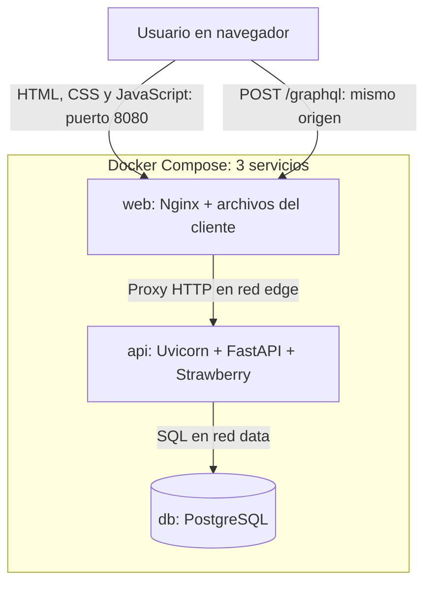
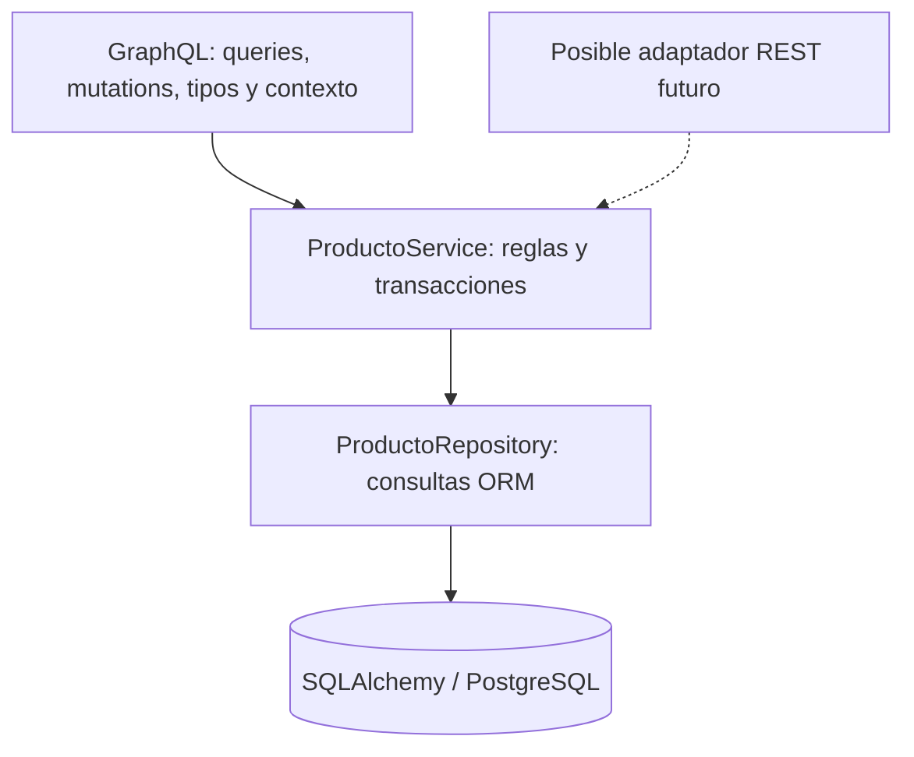

# Productos GraphQL · Aplicación de tres contenedores

CRUD de productos con **FastAPI + Strawberry**, **PostgreSQL** y un **cliente web modular servido por Nginx**. La solución conserva el esquema de responsabilidades del API REST anterior: entrada → servicio → repositorio → persistencia. En este proyecto nuevo, GraphQL es el contrato funcional; no se duplican endpoints REST para productos.

> Estado: implementación inicial para desarrollo local y demostración académica. Incluye código, pruebas y configuración de CI. No incorpora autenticación ni autorización y no debe exponerse directamente a Internet. La publicación en GitHub y la ejecución completa de Docker quedan pendientes de realizarlas en el entorno del propietario. Consulta [la evidencia de validación](docs/VALIDACION.md).

## Contenido

- [Objetivo y alcance](#objetivo-y-alcance)
- [Arquitectura](#arquitectura)
- [Tecnologías](#tecnologías)
- [Inicio rápido](#inicio-rápido)
- [Desarrollo](#desarrollo)
- [Contrato GraphQL](#contrato-graphql)
- [Pruebas y calidad](#pruebas-y-calidad)
- [Seguridad y operación](#seguridad-y-operación)
- [Publicar en GitHub](#publicar-en-github)

## Objetivo y alcance

Construir una aplicación mantenible y reproducible para crear, listar, consultar por ID, actualizar y eliminar productos desde un navegador. Evidenciar separación de responsabilidades, reutilización, contratos explícitos, transacciones, validación, pruebas y decisiones arquitectónicas documentadas.

Incluye:

- Queries `productos` y `producto`.
- Mutations `crearProducto`, `actualizarProducto` y `eliminarProducto`.
- Listado paginado y selección de campos por el consumidor.
- Formularios accesibles, validación, indicadores de carga y mensajes de error.
- Confirmación de eliminación y detección de ediciones con versiones antiguas.
- Persistencia PostgreSQL, migración inicial Alembic y volumen de datos.
- Health checks, logs JSON, identificadores de solicitud y límites de solicitudes.
- Dependencias Python bloqueadas con versiones y hashes; frontend sin dependencias runtime externas.
- Pruebas de servicios, contrato HTTP/GraphQL, cliente y pruebas de PostgreSQL para CI.

Fuera de alcance inicial: inventario, facturación, categorías, imágenes, autenticación, autorización por usuario, subscriptions, alta disponibilidad y exposición pública. No se simula persistencia con datos en memoria ni con localStorage.

## Arquitectura

La solución es un **monolito modular en el backend**, con cliente y base de datos desplegados separadamente. Tres contenedores no equivalen automáticamente a tres microservicios.



El JavaScript del cliente **se ejecuta en el navegador**, no en Nginx. El tercer contenedor entrega los archivos y actúa como proxy inverso. El navegador usa la URL relativa `/graphql`; Nginx resuelve `api:8000` dentro de Docker. El navegador no debe llamar a `http://api:8000`, ni necesita conocer la IP de PostgreSQL.

| Contenedor | Responsabilidad | Exposición predeterminada |
| --- | --- | --- |
| `web` | Servir cliente, proxy GraphQL, cabeceras y límite de solicitudes | `127.0.0.1:8080` |
| `api` | Validar contrato, ejecutar resolvers y casos de uso, gestionar transacciones | Solo red Docker; puerto interno 8000 |
| `db` | Persistir y garantizar restricciones del modelo | Solo red Docker; puerto interno 5432 |

### Capas internas del backend



El adaptador REST del diagrama es una **posibilidad de extensión**, no un componente implementado aquí. El servicio no importa FastAPI ni Strawberry. El repositorio no ejecuta `commit` ni `rollback`. La capa de servicio conserva una dependencia explícita de SQLAlchemy para mantener el patrón del proyecto anterior: es una arquitectura por capas pragmática, no una arquitectura hexagonal pura.

### Decisiones principales

| Decisión | Motivo y compromiso |
| --- | --- |
| FastAPI + Strawberry | Continuidad con el proyecto anterior y contrato GraphQL tipado |
| Servicio y repositorio separados | Reutilizar casos de uso sin acoplarlos al transporte |
| Sesión por resolver | Evitar compartir una `Session` entre ejecuciones concurrentes |
| SQLAlchemy síncrono en thread pool | Conservar el estilo existente sin bloquear el event loop con SQL síncrono |
| PostgreSQL `NUMERIC(12,2)` | Dinero decimal exacto; no `float` como contrato de precio |
| `version` para actualizar y eliminar | Detectar cambios concurrentes sin sobrescribir silenciosamente |
| Frontend con ES modules y DOM nativo | Un CRUD de alcance acotado, menor cadena de dependencias y sin bundler obligatorio |
| Nginx en el contenedor web | Mismo origen para cliente y API; sin CORS permisivo ni cuarto contenedor |
| Alembic | Versionar el esquema; no usar `create_all()` como estrategia de migración productiva |

El frontend no utiliza React. «Moderno» se aborda mediante módulos, HTML semántico, diseño adaptable, `fetch`, validación, manejo de estados y accesibilidad. Si crece hacia múltiples dominios y vistas, puede migrarse a React/TypeScript sin cambiar los casos de uso del backend ni las operaciones GraphQL.

Más detalle: [arquitectura](docs/ARQUITECTURA.md) y [ADRs](docs/ADR.md).

## Tecnologías

| Componente | Tecnología |
| --- | --- |
| Backend | Python 3.12, FastAPI, Strawberry, Uvicorn |
| Validación | Pydantic |
| Persistencia | SQLAlchemy 2.0, Psycopg 3, PostgreSQL 17 |
| Migraciones | Alembic |
| Frontend | HTML5, CSS adaptable, JavaScript ES modules, Fetch API |
| Servidor web | Nginx sin privilegios, rama 1.28 |
| Contenedores | Docker Compose v2 |
| Calidad | Ruff, pytest, pytest-cov, pruebas nativas de Node |
| Integración continua | GitHub Actions |

Las versiones Python exactas están en `backend/requirements.lock` y `backend/requirements-dev.lock`. Las imágenes Docker tienen etiquetas de rama, no digest inmutable; fijar digest y establecer actualización periódica antes de un despliegue controlado.

## Inicio rápido

Requisitos: Git, Docker Engine y Docker Compose v2 con soporte de `--wait`. No necesitas Python ni Node en el host para ejecutar los tres contenedores.

### 1. Obtener el proyecto

Si ya publicaste el repositorio:

```bash
git clone https://github.com/TU_USUARIO/producto-graphql.git
cd producto-graphql
```

Si recibiste el ZIP, extráelo y entra a la carpeta `producto-graphql`. El nombre y la URL de GitHub anteriores son ejemplos: **el repositorio remoto no se crea por descargar estos archivos**.

### 2. Configurar variables

```bash
cp .env.example .env
```

Edita `.env` y cambia `POSTGRES_PASSWORD` y `POSTGRES_ADMIN_PASSWORD` antes del primer arranque. No publiques `.env`. Si una contraseña incluye `$`, utiliza el entrecomillado literal adecuado de Compose; evita pegar secretos en capturas, logs o videos.

| Variable | Uso |
| --- | --- |
| `POSTGRES_DB` | Nombre de la base de datos |
| `POSTGRES_USER` | Rol de aplicación sin superusuario; no usar `postgres` |
| `POSTGRES_PASSWORD` | Clave del rol de aplicación |
| `POSTGRES_ADMIN_PASSWORD` | Clave de inicialización administrativa; no se entrega a la API |
| `WEB_BIND` | Dirección de escucha del host; `127.0.0.1` de forma predeterminada |
| `WEB_PORT` | Puerto web; 8080 de forma predeterminada |
| `GRAPHQL_IDE` | Habilita GraphiQL para desarrollo; `false` antes de publicar |
| `LOG_LEVEL` | Nivel de logs de la aplicación |

### 3. Arrancar

```bash
docker compose config --quiet
docker compose up -d --build --wait
docker compose ps
```

Al primer arranque, PostgreSQL crea el rol de aplicación sin privilegios de administración. La API espera a PostgreSQL, ejecuta `alembic upgrade head` y arranca Uvicorn. Nginx espera a que la API esté lista. El catálogo inicial está vacío: crea los productos desde el formulario.

Abre:

- Cliente: [http://localhost:8080](http://localhost:8080).
- GraphiQL: [http://localhost:8080/graphql](http://localhost:8080/graphql), si `GRAPHQL_IDE=true`. GraphiQL puede requerir conexión a Internet para sus recursos de interfaz; el cliente principal no carga bibliotecas externas.

Para acceso desde otro equipo de tu LAN, configura deliberadamente `WEB_BIND` con la IP LAN del servidor y restringe el puerto mediante firewall. Entra usando esa IP, no `localhost`. Esta base **no autentica usuarios**: quien acceda podrá modificar y eliminar productos.

### 4. Comprobar el contrato

```bash
curl --fail http://localhost:8080/healthz

curl http://localhost:8080/graphql \
  -H 'Content-Type: application/json' \
  -d '{"query":"{ productos { total items { id nombre precio version } } }"}'
```

`/healthz` comprueba Nginx, no toda la cadena. La query de productos verifica además API, contrato, tabla y acceso a datos.

### 5. Detener sin borrar datos

```bash
docker compose down
```

El volumen conserva PostgreSQL. No añadas `-v` si quieres preservar datos. Las credenciales de inicialización solo se aplican a un volumen nuevo: cambiar `.env` no cambia automáticamente las claves de los roles ya creados.

## Desarrollo

```bash
docker compose -f compose.yaml -f compose.dev.yaml up -d --build --wait
```

Este modo monta `backend/app`, `backend/tests`, `backend/alembic` y `frontend/dist`. Uvicorn usa `--reload`; para el frontend basta guardar y recargar el navegador. No utilizar este override en producción.

| Cambio | Acción |
| --- | --- |
| Python en `backend/app` en modo desarrollo | Guardar; Uvicorn recarga |
| HTML/CSS/JS en `frontend/dist` en modo desarrollo | Guardar y recargar navegador |
| Pruebas | Guardar y ejecutar nuevamente |
| Dependencias o Dockerfile | Actualizar lockfiles cuando corresponda y reconstruir |
| Variables de entorno | Recrear el servicio; un `restart` no carga valores nuevos |
| Esquema de datos | Crear/revisar migración y aplicar Alembic |
| Código en modo base sin volúmenes | Reconstruir la imagen y recrear el contenedor |

En modo desarrollo la API también está disponible en `127.0.0.1:8000`, con `/health/live`, `/health/ready`, `/docs` y `/graphql`. Swagger documenta HTTP, no sustituye GraphiQL como explorador del contrato.

Para dependencias, desde `backend`, con `uv` disponible:

```bash
uv pip compile pyproject.toml --generate-hashes -o requirements.lock
uv pip compile pyproject.toml --extra dev --generate-hashes -o requirements-dev.lock
```

Revisa los cambios, ejecuta las pruebas y registra ambos lockfiles. No basta editar `pyproject.toml`: los Dockerfiles instalan los locks.

## Estructura y responsabilidades

| Ubicación | Responsabilidad |
| --- | --- |
| `compose.yaml` | Los tres servicios, redes, volumen, dependencias y salud |
| `compose.dev.yaml` | Montajes y recarga para desarrollo |
| `backend/app/main.py` | Fábrica de aplicación, middleware, health checks y registro del router |
| `backend/app/core/config.py` | Configuración externa y URL de PostgreSQL |
| `backend/app/core/exceptions.py` | Errores de aplicación con códigos estables |
| `backend/app/core/logging.py` | Logs JSON sin cuerpos de solicitudes |
| `backend/app/db/base.py` | Base declarativa SQLAlchemy |
| `backend/app/db/session.py` | Engine y fábrica de sesiones |
| `backend/app/products/model.py` | Mapeo ORM y control optimista de versión |
| `backend/app/products/schemas.py` | Reglas de validación de datos de producto |
| `backend/app/products/repository.py` | Consultas SQLAlchemy y operaciones de persistencia |
| `backend/app/products/service.py` | Casos de uso, validación, commit y rollback |
| `backend/app/graphql/types.py` | Tipos de entrada/salida y conversión de modelos |
| `backend/app/graphql/context.py` | Sesión por resolver, thread pool y traducción de errores |
| `backend/app/graphql/queries.py` | Lecturas GraphQL |
| `backend/app/graphql/mutations.py` | Escrituras GraphQL |
| `backend/app/graphql/schema.py` | Schema, router y límites de consultas |
| `backend/alembic/` | Migraciones versionadas |
| `backend/tests/` | Contrato, servicios, arquitectura e integración PostgreSQL |
| `frontend/dist/index.html` | Vista semántica, formularios y diálogos |
| `frontend/dist/styles.css` | Diseño adaptable y estados visuales |
| `frontend/dist/js/app.js` | Eventos, estado y representación de la interfaz |
| `frontend/dist/js/products-api.js` | Operaciones GraphQL del dominio producto |
| `frontend/dist/js/graphql-client.js` | Transporte HTTP, timeout y errores |
| `frontend/dist/js/validation.js` | Validación de UX y dinero decimal como texto |
| `frontend/nginx.conf` | Servidor estático y proxy de mismo origen |
| `frontend/tests/` | Pruebas de validación y transporte |
| `infra/postgres/01-app-user.sh` | Rol de aplicación separado del administrador |
| `scripts/smoke.py` | Recorrido CRUD sobre un registro temporal propio |
| `.github/workflows/ci.yml` | Validación automatizada y prueba del Compose en CI |
| `docs/` | Arquitectura, ADRs, operaciones y evidencia de validación |

`frontend/dist` contiene archivos **fuente estáticos mantenidos directamente**, no un build generado por Vite. Su manifiesto de vista estática no despliega esta solución de PostgreSQL/FastAPI; el despliegue de referencia es Docker Compose.

## Contrato GraphQL

Endpoint funcional: `POST /graphql`, contenido `application/json`. Las queries por GET están deshabilitadas; el GET HTML queda para GraphiQL cuando está habilitado. No se implementan subscriptions ni WebSocket.

### Modelo Producto

| Campo | Regla |
| --- | --- |
| `id` | Entero positivo generado por PostgreSQL |
| `nombre` | Entre 1 y 120 caracteres, sin espacios externos |
| `descripcion` | Opcional, hasta 2000 caracteres |
| `precio` | Decimal positivo, máximo `9999999999.99`, hasta 2 decimales |
| `version` | Entero utilizado para comprobar conflictos |
| `creadoEn`, `actualizadoEn` | Marcas temporales; PostgreSQL almacena instantes con zona horaria |

Los precios viajan como texto decimal, por ejemplo `"850000.00"`. La aplicación no define moneda ni realiza conversión de divisas. Se asume una sola moneda por catálogo, por acordar; en un catálogo multimoneda se deberá añadir un código ISO 4217 al contrato.

### Consultar y paginar

```graphql
query {
  productos(limite: 20, offset: 0) {
    items { id nombre descripcion precio version }
    total
    limite
    offset
  }
  producto(id: 1) { id nombre precio version }
}
```

El listado devuelve un objeto paginado, no la lista directa del ejercicio anterior. El límite permitido es 1–100 y el orden es estable por ID. Offset es suficiente para esta escala, pero bajo cambios concurrentes puede repetir u omitir registros entre páginas; para volúmenes mayores se recomienda paginación por cursor.

### Crear

```graphql
mutation Crear($datos: ProductoInput!) {
  crearProducto(datos: $datos) { id nombre precio version }
}
```

Variables:

```json
{"datos":{"nombre":"Monitor","descripcion":"Monitor IPS","precio":"850000.00"}}
```

### Actualizar

```graphql
mutation Actualizar($id: Int!, $version: Int!, $datos: ProductoInput!) {
  actualizarProducto(id: $id, version: $version, datos: $datos) {
    id nombre descripcion precio version
  }
}
```

Variables (utiliza el ID y la versión realmente recibidos):

```json
{"id":1,"version":1,"datos":{"nombre":"Monitor 27","descripcion":null,"precio":"900000.00"}}
```

La actualización es completa: `nombre` y `precio` son obligatorios. Omitir `descripcion` la deja en `null`; no se implementa PATCH parcial. Conserva la nueva versión devuelta para la siguiente modificación.

### Eliminar

```graphql
mutation Eliminar($id: Int!, $version: Int!) {
  eliminarProducto(id: $id, version: $version) { id eliminado }
}
```

Se realiza borrado físico con confirmación en la interfaz. No hay papelera ni recuperación individual implementada. Repetir una eliminación devuelve `NOT_FOUND`.

### Manejo de errores

Un HTTP 200 puede contener `errors`; el cliente inspecciona ambos niveles. Los errores de negocio incluyen `extensions.code` y `extensions.requestId`. Los errores de sintaxis o validación propios del motor GraphQL no necesariamente llevan esos campos.

| Código | Significado | Acción del cliente |
| --- | --- | --- |
| `VALIDATION_ERROR` | Datos o paginación inválidos | Corregir el formulario |
| `NOT_FOUND` | El producto no existe | Actualizar el listado |
| `CONFLICT` | La versión cambió | Volver a consultar y revisar los cambios |
| `PERSISTENCE_ERROR` | Fallo de persistencia | Mostrar aviso y referencia |
| `INTERNAL_ERROR` | Fallo inesperado | Avisar sin exponer stack trace |

No se reintentan automáticamente las mutations. Una pérdida de conexión o timeout no demuestra que una escritura haya sido revertida: consulta el estado antes de repetirla.

## Pruebas y calidad

En el contenedor de desarrollo:

```bash
docker compose -f compose.yaml -f compose.dev.yaml exec api ruff check --no-cache .
docker compose -f compose.yaml -f compose.dev.yaml exec api ruff format --check --no-cache .
docker compose -f compose.yaml -f compose.dev.yaml exec api \
  python -m pytest -q -p no:cacheprovider -m 'not postgres'
```

Fuera de Docker, con Python 3.12 y Node 22 o posterior:

```bash
cd backend
python -m venv .venv
. .venv/bin/activate
pip install --require-hashes -r requirements-dev.lock
python -m pytest -q --cov=app --cov-report=term-missing
cd ../frontend
node --test tests/validation.test.js
```

Las pruebas rápidas usan SQLite temporal. **No sustituyen las pruebas de PostgreSQL**. La CI configura `TEST_DATABASE_URL` hacia una base aislada terminada en `_test`; las pruebas de integración crean y eliminan la tabla `productos` de esa base. Nunca apuntar esa variable a datos reales.

Smoke sobre el despliegue, desde la raíz:

```bash
python3 scripts/smoke.py http://localhost:8080/graphql
```

Este comando crea y elimina un registro de prueba propio. No borra productos existentes. Si la conexión se pierde, puede quedar el registro temporal y debe revisarse manualmente.

CI ejecuta:

1. Ruff, formato y pruebas backend, con umbral de cobertura del 80%.
2. Migración inicial, verificación de diferencias del modelo y pruebas PostgreSQL.
3. Pruebas del cliente con Node, sin instalación de paquetes.
4. Construcción y arranque de los tres contenedores, comprobación de Nginx y smoke CRUD.

El umbral excluye `app/main.py`; no es una medida de cobertura de todo el sistema. Configurar las comprobaciones como obligatorias en la protección de `main` después de crear el repositorio. La existencia del YAML no demuestra que la CI haya pasado: verificar su primera ejecución.

## Seguridad y operación

- PostgreSQL no publica puertos; la API utiliza un rol sin superusuario.
- API y web se ejecutan sin root, con filesystem de solo lectura y `/tmp` temporal.
- Nginx aplica 64 KiB de cuerpo máximo y límite de 10 solicitudes/s por IP con ráfaga de 20.
- GraphQL limita profundidad a 6, aliases a 10 y tokens a 1000. No es un cálculo completo de costo de consultas.
- La interfaz utiliza `textContent`, no HTML construido a partir de datos de productos.
- El cliente sirve sus recursos localmente y tiene una política CSP restrictiva.
- La API no registra los cuerpos GraphQL ni contraseñas; los logs incluyen identificadores y duración.
- `/health/live` verifica el proceso; `/health/ready` verifica conectividad SQL con `SELECT 1`, no integridad de todo el esquema.
- Cada mutation tiene su propia transacción. Varias mutations en un mismo documento **no forman una sola transacción atómica**.
- `depends_on` ayuda al arranque; no proporciona alta disponibilidad ni reinicia automáticamente un contenedor solo por quedar `unhealthy`.

```bash
docker compose logs -f api
docker compose logs --tail=100 web db
```

Antes de producción: autenticación OIDC/JWT, autorización por rol en los casos de uso, TLS, secretos gestionados, rol de migración separado del de ejecución, copias de seguridad con restauración probada, alertas y métricas, auditoría de cambios, escaneo de dependencias/imágenes, límites de costo e idempotencia de escrituras donde sean necesarios. No usar CORS como mecanismo de autenticación.

Ver [guía de operación](docs/OPERACION.md) para migraciones, copias, fallos y mejoras.

## Publicar en GitHub

Nombre propuesto: `producto-graphql`. Elegir inicialmente repositorio privado hasta revisar secretos, licencia y datos. Los archivos entregados no incluyen historial `.git` ni crean un repositorio en tu cuenta.

Desde la raíz del proyecto:

```bash
git init -b main
git status --short
git add .
git diff --cached --stat
git diff --cached --name-only
```

Comprueba que **no se incluyan `.env`, contraseñas reales, bases de datos ni backups**. Los `.env.example` y las credenciales de pruebas de CI son ejemplos deliberados, no secretos de producción.

Después de revisar:

```bash
git commit -m "feat: add three-container GraphQL product application"
```

Crea un repositorio vacío en GitHub, sin README ni licencia automáticos, o utiliza GitHub CLI si está instalado y autenticado:

```bash
gh repo create producto-graphql --private --source=. --remote=origin --push
```

Alternativa después de crear el repositorio vacío desde GitHub:

```bash
git remote add origin https://github.com/TU_USUARIO/producto-graphql.git
git push -u origin main
```

Estos caminos son alternativos: no ejecutes ambos para crear el remoto. Sustituye `TU_USUARIO` por tu cuenta. Define la licencia antes de abrir el código; no se ha impuesto ninguna licencia en este proyecto.

## Referencias técnicas

- [FastAPI: integración GraphQL](https://fastapi.tiangolo.com/how-to/graphql/).
- [Strawberry: integración FastAPI y contexto](https://strawberry.rocks/docs/integrations/fastapi).
- [SQLAlchemy: sesiones y concurrencia](https://docs.sqlalchemy.org/en/20/orm/session_basics.html).
- [SQLAlchemy: versionado optimista](https://docs.sqlalchemy.org/en/20/orm/versioning.html).
- [Docker Compose: orden de inicio y salud](https://docs.docker.com/compose/how-tos/startup-order/).
- [Alembic: tutorial de migraciones](https://alembic.sqlalchemy.org/en/latest/tutorial.html).
