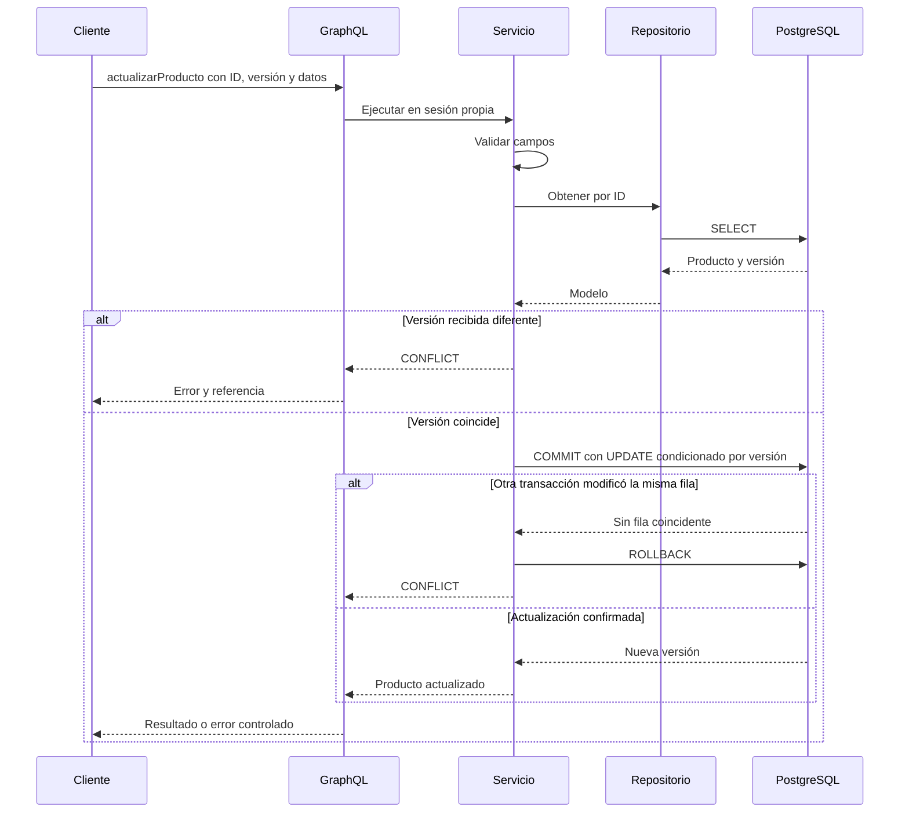

# Arquitectura de la solución

## 1. Contexto y alcance

Un usuario administra productos en una aplicación de una sola página. El sistema mantiene un catálogo persistente y permite cambios concurrentes detectables. No procesa pagos, pedidos, stock ni identidades de usuarios.

La solución tiene tres **unidades de despliegue**: web, API y base de datos. El backend es un monolito modular, no una colección de microservicios. La unidad funcional es el módulo producto; las capas técnicas no se convierten en servicios independientes.

## 2. Separación de responsabilidades

| Capa | Decide | No debe decidir |
| --- | --- | --- |
| Interfaz web | Representación, interacción, validación de UX | SQL, transacciones, validación definitiva |
| Cliente GraphQL | Documentos, variables, transporte y errores | Reglas de persistencia |
| Nginx | Entrega de archivos, proxy y controles HTTP | Lógica de negocio |
| Resolver | Traducción de entrada/salida e invocación del caso de uso | SQL directo, commit o rollback |
| Contexto | Dependencias, sesión por resolver, ejecución en hilo y errores públicos | Reglas particulares de producto |
| Servicio | Validación de negocio, existencia, versión y transacción | Rutas HTTP, componentes visuales |
| Repositorio | Consultas ORM y acceso a persistencia | Respuestas HTTP, serialización GraphQL |
| PostgreSQL | Integridad y almacenamiento durable | Experiencia de usuario |

## 3. Flujo de actualización

Hay dos comprobaciones: el servicio compara la versión que envió el usuario con la que leyó; SQLAlchemy agrega la versión al `WHERE` de la escritura para detectar otra modificación entre lectura y commit. Una comprobación solo en Python no cubriría esa segunda ventana.

## 4. Sesiones y concurrencia GraphQL

Las queries pueden ejecutar varios resolvers concurrentemente. No se entrega una sesión SQLAlchemy compartida en el contexto. El contexto mantiene una **fábrica de sesiones**; por cada resolver crea, usa y cierra una sesión dentro del mismo trabajo del thread pool.

La conversión del modelo a `ProductoType` ocurre dentro de esa sesión. No se devuelven modelos ORM que luego disparen lecturas diferidas en el event loop. El uso de pool y `pool_pre_ping` ayuda a reutilizar conexiones válidas, pero no proporciona reintentos transaccionales automáticos.

Cada mutation confirma su propia transacción. Una operación GraphQL con varias mutations no es atómica como conjunto. Si el negocio exige cambiar varias entidades de forma indivisible, debe existir un caso de uso y una mutation que agrupen esos cambios en una sola transacción.

## 5. Datos y contrato

- Precio: `Decimal` en Python, `NUMERIC(12,2)` en PostgreSQL y texto decimal en JSON.
- Identidad: entero generado; no equivale a código de negocio o SKU.
- Nombres repetidos permitidos: no se ha definido una regla de unicidad.
- Descripción opcional; actualización completa, no patch parcial.
- Eliminación física, sin tabla de auditoría ni papelera en esta versión.
- Fechas con zona en PostgreSQL; la API produce timestamps a partir de UTC.
- Paginación por offset con orden por ID. La consulta del total y la de filas son lecturas separadas; no se garantiza una fotografía idéntica bajo escritura concurrente.
- Seleccionar menos campos GraphQL reduce el contrato devuelto; no significa que SQLAlchemy proyecte automáticamente menos columnas SQL.

## 6. Despliegue y comunicaciones

La red `edge` une web y API. La red interna `data` une API y PostgreSQL. El contenedor web no pertenece a `data`. La API no tiene puerto publicado en el Compose base y PostgreSQL tampoco. Solo `web` publica 8080 en loopback.

Nginx re-resuelve el nombre `api` mediante el DNS de Docker para tolerar recreaciones de contenedores. Un timeout de proxy o de cliente no cancela necesariamente el trabajo SQL iniciado en el servidor.

El contenedor PostgreSQL inicializa un administrador y un usuario de aplicación separado. Este último puede crear objetos en `public` porque también ejecuta las migraciones de la aplicación local. Para producción se debe separar el usuario migrador del usuario runtime de mínimos privilegios.

## 7. Atributos de calidad y evidencias

Los siguientes son criterios de aceptación y objetivos; no se presentan como resultados de una prueba de carga ya ejecutada.

| Atributo | Mecanismo | Evidencia o validación |
| --- | --- | --- |
| Mantenibilidad | Módulo producto y separación entre adaptadores/servicio/repositorio | Prueba AST de dependencias y revisión de código |
| Integridad | Decimal, restricciones SQL, rollback y versión optimista | Pruebas de servicio y pruebas sobre PostgreSQL |
| Reproducibilidad | Compose, lockfiles y migraciones | CI construye y ejecuta tres contenedores desde cero |
| Seguridad básica | Red privada, usuario de aplicación, procesos no root, límites | Inspección de Compose y prueba en runtime pendiente |
| Operabilidad | Liveness, readiness, logs y request ID | Pruebas de health y revisión de logs |
| Usabilidad | Formularios, validación, estados vacíos/error y confirmación | Pruebas JS; revisión de teclado y navegador pendiente |
| Rendimiento | Paginación y conexiones reutilizadas | Medir p95 con 10 000 productos y 10 usuarios concurrentes |
| Continuidad | Volumen y procedimiento de backup/restauración | Restaurar en una base aislada y documentar duración |

Objetivo inicial de rendimiento sugerido: p95 menor a 500 ms en consultas de 20 productos dentro de la LAN bajo el escenario anterior. Debe validarse y ajustarse con CPU, memoria, almacenamiento y volumetría definidos; no es un SLA comprometido.

## 8. Evolución controlada

1. Validar el despliegue en Docker y la primera ejecución de CI.
2. Incorporar identidad y roles antes de permitir acceso de terceros.
3. Separar credenciales runtime y migraciones; fijar digest de imágenes y revisar vulnerabilidades.
4. Incorporar auditoría de cambios y política de backup con restauraciones periódicas.
5. Añadir cursor, búsquedas e índices solo cuando el uso real lo justifique.
6. Si aparecen entidades relacionadas, evaluar DataLoader para evitar N+1; no hace falta para el modelo plano actual.
7. Si se necesitan altas garantías ante reenvíos, añadir clave de idempotencia persistida en la misma transacción que la creación.
8. Si aumentan los adaptadores y pruebas aisladas, extraer puertos de repositorio y unidad de trabajo. El servicio actual está desacoplado de GraphQL, pero no del ORM.

No se introducen Kafka, Redis, un API Gateway separado o microservicios para resolver un único CRUD. Toda incorporación futura debe corresponder a un requisito y quedar registrada mediante ADR.
